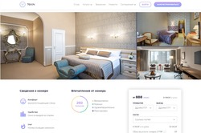
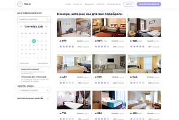

## Макет страниц по поиску номеров в отеле TOXIN 

-----
*[**Обучающее задание 2**](https://rizzoma.com/topic/d5c429337bcaa70548fb5aeedee6d92b/0_b_8ndo_78h6s/) на фронтенд разработчика от `#fsd` `#fsd_team`*  
Макет:* [*https://www.figma.com/MetaLamp-education-program*](https://www.figma.com/file/nDL1LMsLtaD4XEAfQZCVIR/MetaLamp-(former-FSD)-frontend-education-program.-The-2nd-task-(Copy)) 

-----
**Github pages:** [**https://rybakovlg.github.io/HotelRoomSearch**](https://rybakovlg.github.io/HotelRoomSearch__fsd_team__aducation/index.html) :octocat:  
**Ветка с итоговым бандлом:** [**https://github.com/RybakovLG//tree/gh-pages**](https://github.com/RybakovLG/HotelRoomSearch__fsd_team__aducation/tree/gh-pages) :file_folder:

|  |  | 
|:---:|:---:|:---:|
[*Регистрация*](https://rybakovlg.github.io/HotelRoomSearch__fsd_team__aducation/app/registration-page.html) | [*О номере*](https://rybakovlg.github.io/HotelRoomSearch__fsd_team__aducation/app/room-details.html) | [*Поиск*](https://rybakovlg.github.io/HotelRoomSearch__fsd_team__aducation/app/search-room.html)

###Установка: :metal:  
`git clone https://github.com/RybakovLG/HotelRoomSearch__fsd_team__aducation.git && cd HotelRoomSearch__fsd_team__aducation && npm i`

----
| :video_game: | :package: |
|:---:|:---:|
| - **Webpack** - **jQuery** - **Sass** - **Pug** - |  |
| `npm run w` | **dev-server**  |
| `npm run d` | **development** | 
| `npm run b` | **production** |

----
### Дополнительно:
- **Подключены и настроены плагины:**
  - *Выпадающий выбор дат (2 варианта)*
  - *Пагинация (не включена)*
  - *Диапазон цены*
  - *Слайдер*
  - *Рейтинг*
- **Все мелкие икинки - SVG**
- **Графика оптимизирована**
  - *сжимается imagemin webpack при сборке*
- **Страницы адаптивны от 320w**
- **Адаптивные изображения и фоны**
  - *от ширины экрана / плотности пикселей*
  - *меняются разрешение / степень сжатия / формат*
- **Близкие к 100 баллам Performance Lighthouse**
- **Элементы навигации не сдвигают макет при наведении**
  - *имеют bold on hover без фикс. ширины*
- **Небольшие активные элемнты имеют минимум 44px для тапа**
- **БЭМ - именование классов**
